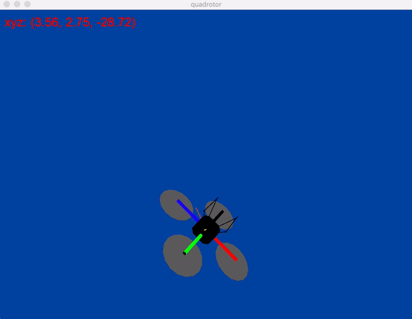
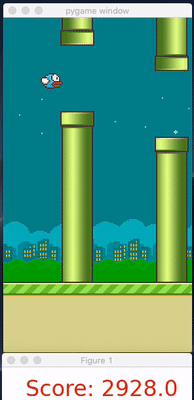

# rl-practice-parl
Reinforcement learning practices with framework PARL.

> [PARL](https://github.com/PaddlePaddle/PARL) is a flexible and high-efficient reinforcement learning framework.

This repository is inspired by the one week [open course](https://aistudio.baidu.com/aistudio/education/group/info/1335)
of PARL. It's a wonderful course for beginners of reinforcement learning and those who want a good RL framework for 
practice or research.

As a newbie of both reinforcement learning and PARL myself, I followed the course lives at night after work. During the
week of course, I tried Sarsa, Q-learning, DQN, Policy Gradient and DDPG in [OpenAI Gym](https://gym.openai.com/) and 
[RLSchool](https://github.com/PaddlePaddle/RLSchool) environments. After the course ended, I dived into a few more 
cases during weekends for the "Final Reproduce Tasks".

In this repository, I put all the codes of my homework and the new cases I tried with PARL. You can see it's really
simple to run a RL project with PARL, only a few lines of codes modifications are needed for running different projects.
Also, as reinforcement learning takes a long time to train, some pre-trained models are presented and you can download
and see how it works in a minute!

## codes4courses
It contains the notebooks for homework projects. For projects #4 and #5, pre-trained models are included.
- 1. gridworld
- 2. maze 
    - 2.1 maze-sarsa 
    - 2.2 maze-q-learning 
- 3. mountaincar-dqn 
- 4. pong-pg
- 5. quadrotor-hovering-ddpg

## RL-Quadrotor
Notebook, codes and results of Quadrotor Velocity Control task.

- "velocity_control" task

Yellow arrow is the expected velocity vector; orange arrow is the real velocity vector.

## RL-FlappyBird
Notebook, codes and results of Flappy Bird in pygame.

- FlappyBird

