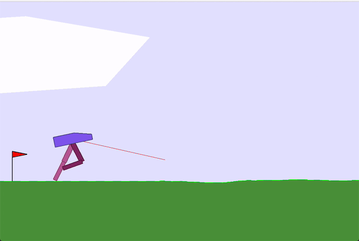
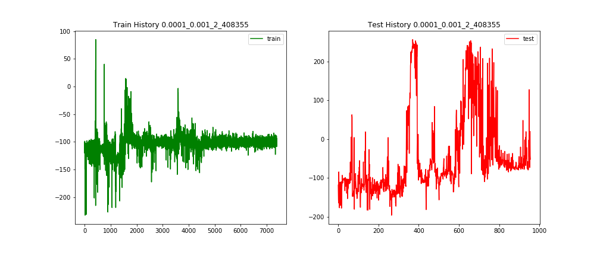

# RL-BipedalWalker
Control BipedalWalker with Reinforcement Learning DDPG algorithm.

Simulation Environment: [BipedalWalker](https://gym.openai.com/envs/BipedalWalker-v2/)

Reward is given for moving forward, total 300+ points up to the far end. If the robot falls, it gets -100.
To solve the game you need to get 300 points in 1600 time steps. 
To solve hardcore version you need 300 points in 2000 time steps.

> You may need to try v3 if v2 is not valid in your gym.

#### BipedalWalker
Below gif demonstrates the performance of the pre-trained model in model_dir. The robot can reach the far end easily.

<div align="center"></div> 

#### training and testing reward curve
This is the history reward of training process for:
- ACTOR_LR = 0.0001  # Actor网络更新的 learning rate
- CRITIC_LR = 0.001   # Critic网络更新的 learning rate

<div align="center"></div>

The whole training was 1 million steps, and the best model was at step 408355.

#### bipedalWalker.ipynb
The models were trained in a jupyter lab server, you can run and try it by yourself.

#### model_dir
I've tried 2 models with different architectures, according to the results, model #2 with 3 hidden layers performs better.

The best pre-trained model is stored in directory model_dir.

#### How to play
Modify train.py or bipedalWalker.ipynb to run test or train your own model.

Uncomment different lines in train.py
```python
# parallel(15)  # train from beginning with multi-parameter-combinations
# test_best(render=True)  # test current best model
# fine_tune(ACTOR_LR=0.0001, CRITIC_LR=0.001, episodes=1e6, go_steps=1)  # fine tune existing model 
# one(ACTOR_LR=0.0001, CRITIC_LR=0.001, model_tag=2, load_model=False, go_steps=1, f_best='', gpu='') # train from beginning
```

#### Installation
First install requirements:
```shell script
pip install -r requirements.txt
```
Then try with:
```shell script
python train.py
```
