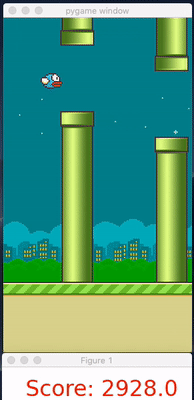

# RL-FlappyBird
Play Flappy Bird with Reinforcement Learning DQN algorithm.

Simulation Environment: [PyGame Learning Environment](https://github.com/ntasfi/PyGame-Learning-Environment)

Here we can use RGB image or state data as input.

>If you see below message when running the examples in PLE, don't worry, it doesn't matter, you can still play FlappyBird
> and many other games.
```python
  couldn't import doomish
  Couldn't import doom
```

FlappyBird does not have a specified reward threshold at which it's considered solved. Go get as high as you can!

#### FlappyBird
Below gifs demonstrate the beginning and ending of a running with model
**dqn_model_1600_2274.5.ckpt**, the final score is **2932**.

<div align="center"></div>

<div align="center"></div>


#### training and testing reward curve

This is the history reward of training process for:
- LEARNING_RATE = 0.0005  # 学习率
- GAMMA = 0.99  # reward 的衰减因子，一般取 0.9 到 0.999 不等

<div align="center"></div>


#### model_dir
There are two pre-trained models with average scores 2274.5 and 1911.0, respectively.

#### How to play
Modify train.py to run test or train your own model.

Uncomment different lines in train.py
```python
## Fine tune an existing model
# main(lr_scheduler, max_episode=100000, load_model=True, go_steps=1, f_pretrain='./model_dir/dqn_model_1600_2274.5.ckpt')

## Train a new model
# main(lr_scheduler, max_episode=20000, load_model=False, go_steps=1, f_pretrain='')

## Test a pre-trained model
# test(f_model='./model_dir/dqn_model_1600_2274.5.ckpt', rounds=1)
```

#### Installation
First install requirements:
```shell script
pip install -r requirements.txt
```
Then try with:
```shell script
python train.py
```