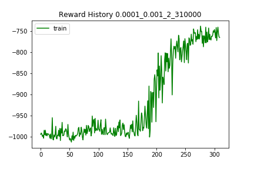
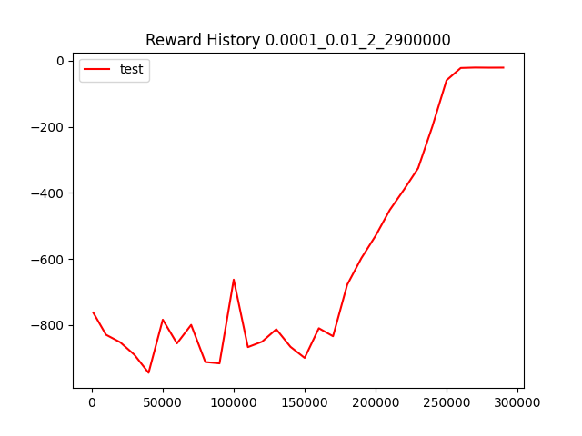

# RL-Quadrotor
Control Quadrotor with Reinforcement Learning DDPG algorithm.

Simulation Environment: [RLSchool](https://github.com/PaddlePaddle/RLSchool/tree/master/rlschool/quadrotor)

The theoretical reward limit of this environment is 0. In reality, it will always be a negative number. If one choose
randome actions at every step, he may get -1000 reward score on average.

#### "velocity_control" task
<div align="center"></div>

Yellow arrow is the expected velocity vector; orange arrow is the real velocity vector.

#### training reward curve

This is the history reward of training process for 
- ACTOR_LR = 0.0001  # Actor网络更新的 learning rate
- CRITIC_LR = 0.01   # Critic网络更新的 learning rate

<div align="center"></div>

#### testing reward curve
This is the history reward of training process for 
- ACTOR_LR = 0.0001  # Actor网络更新的 learning rate
- CRITIC_LR = 0.01   # Critic网络更新的 learning rate

<div align="center"></div>

```log
[06-24 15:00:52] Steps 1000, Test reward: -762.7086458010807, Pid 2091,
[06-24 15:06:42] Steps 10000, Test reward: -829.7039667937222, Pid 2091,
[06-24 15:12:35] Steps 20000, Test reward: -852.4363611066034, Pid 2091,
[06-24 15:25:55] Steps 30000, Test reward: -890.2888413747776, Pid 2091,
[06-24 15:40:14] Steps 40000, Test reward: -944.8511112290838, Pid 2091,
[06-24 15:53:37] Steps 50000, Test reward: -784.0590945328481, Pid 2091,
[06-24 16:07:03] Steps 60000, Test reward: -855.8486625998139, Pid 2091,
[06-24 16:19:51] Steps 70000, Test reward: -799.8168379567369, Pid 2091,
[06-24 16:33:05] Steps 80000, Test reward: -912.232263850097, Pid 2091,
[06-24 16:44:50] Steps 90000, Test reward: -916.3884415020957, Pid 2091,
[06-24 16:57:24] Steps 100000, Test reward: -662.8122111417573, Pid 2091,
[06-24 17:07:38] Steps 110000, Test reward: -867.1186427192512, Pid 2091,
[06-24 17:19:43] Steps 120000, Test reward: -850.6192040495522, Pid 2091,
[06-24 17:31:08] Steps 130000, Test reward: -813.0204828788839, Pid 2091,
[06-24 17:50:33] Steps 140000, Test reward: -866.1568347984497, Pid 2091,
[06-24 18:12:25] Steps 150000, Test reward: -899.8092394086783, Pid 2091,
[06-24 18:34:24] Steps 160000, Test reward: -810.002053436185, Pid 2091,
[06-24 18:55:42] Steps 170000, Test reward: -834.2204623337742, Pid 2091,
[06-24 19:18:21] Steps 180000, Test reward: -678.3010998954585, Pid 2091,
[06-24 19:42:09] Steps 190000, Test reward: -597.7732324663257, Pid 2091,
[06-24 20:06:25] Steps 200000, Test reward: -530.1607985418766, Pid 2091,
[06-24 20:31:37] Steps 210000, Test reward: -452.0446451767078, Pid 2091,
[06-24 20:54:45] Steps 220000, Test reward: -390.4326686014964, Pid 2091,
[06-24 21:18:19] Steps 230000, Test reward: -325.3508323530837, Pid 2091,
[06-24 21:41:43] Steps 240000, Test reward: -199.32448169918712, Pid 2091,
[06-24 22:05:06] Steps 250000, Test reward: -59.3122072805849, Pid 2091,
[06-24 22:28:13] Steps 260000, Test reward: -22.073456152122567, Pid 2091,
[06-24 22:51:14] Steps 270000, Test reward: -20.83232294219092, Pid 2091,
[06-24 23:14:03] Steps 280000, Test reward: -21.181337010550315, Pid 2091,
[06-24 23:38:14] Steps 290000, Test reward: -21.038376223579, Pid 2091,
```

#### quadrotor-velocity.ipynb
The models were trained in a remote jupyter lab server, thus the logs in the notebook stopped updating when I closed my
web browser. The good news is that the remained logs can clearly show a convergence of different models.

#### model_dir  and model_dir_all
I've tried 2 models with 15 parameter combinations, according to the results, many settings converged after 200000
training episodes. 

All pre-trained models are in model_dir_all, and you can put any model you want to try in model_dir.

#### How to play
Modify train.py or quadrotor-velocity.ipynb to run test or train your own model.

Uncomment different lines in train.py
```python
# parallel(15)  # train from beginning
# test_best(render=True)  # test current best model
# fine_tune(ACTOR_LR=0.0001, CRITIC_LR=0.01, episodes=10, go_steps=1)  # fine tune existing model
```

#### Installation
First install requirements:
```shell script
pip install -r ../requirements.txt
```
Then try with:
```shell script
python train.py
```
